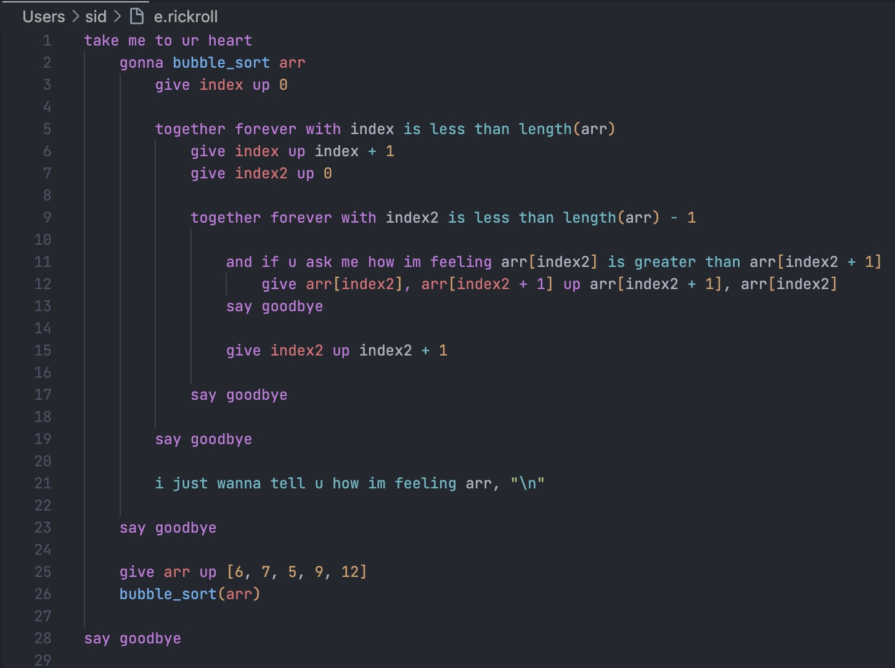
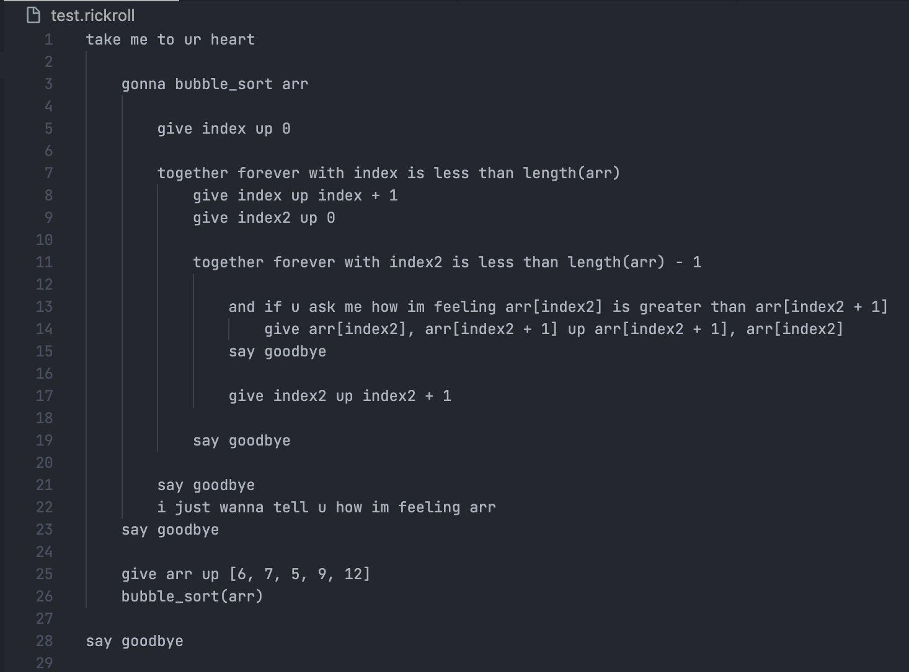

# Rickroll-Lang VSCode Extension

Syntax highlighting and Snippets for the Rickroll-Lang programming language

---

## What is this?

This VS Code extension provides 3 things, Snippets, Syntax Highlighting and Rickroll Commands. It works with rickroll files so to get support for the syntax highlighting use one of the supported file extenstions: `.rickroll`, `.rr`, `.ricklang`, `.rickastley`, `.rick`. You can see an example of the syntax highlighting [bellow](#with-vs-without).

This extenstion also provides snippets for common rickroll-lang keywords or statments. For example if you want to print something you could type the whole print statement out `i just wanna tell you how im feeling` or you could type `rr-print` and it would insert the statement there.  

Lastly the extension provides to commands: `Rickroll` and `Rickroll Me`. Rickroll will open "Never gonna give you up" in your browser wherase Rickroll Me will rickroll you in vscode itself.

---

## Rickroll-Lang

The Rick Roll programming language is a rickroll based, process oriented, dynamic, strong, esoteric programming language. All of the keywords/statements are from Rick Astley's lyrics. 

### Links
* [Discord Server](https://discord.gg/yzZ3MfGZ8A)  
* [Official Github](https://github.com/Rick-Lang/rickroll-lang/)
* [Guide / Extra Scripts](https://github.com/FusionSid/Rick-Lang-Scripts) 

### Credit:
- Satin Wuker - Language Creator
- Rick Astley - Song Artist

---

## With vs Without:

