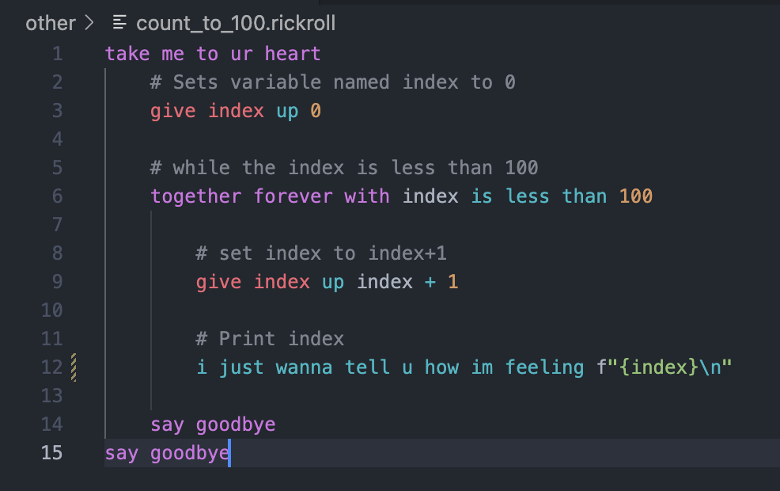
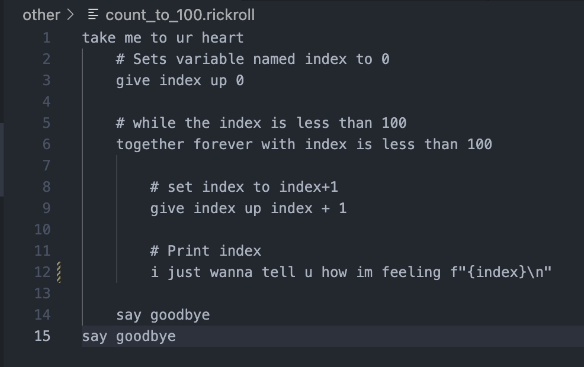

# Rickroll-Lang VSCode Extension

The Rick Roll programming language is a rickroll based, process oriented, dynamic, strong, esoteric programming language. All of the keywords/statements are from Rick Astley's lyrics. 

[Discord server](https://discord.gg/yzZ3MfGZ8A)  
[Official Github](https://github.com/Rick-Lang/rickroll-lang/)

This vscode extension currently only has some snippets for the language. It has a rickroll command which opens the song in your browser. Also it adds the RickRoll langauge to you list so when you oepn a `.rickroll` file it shows the language as Rickroll-Lang in the bottom

I will add syntax highlighting when i figure out how to do so.

### [Guide / Extra Scripts](https://github.com/FusionSid/Rick-Lang-Scripts) 

### Credit:
- Satin Wuker
- Rick Astley

## With vs Without:

